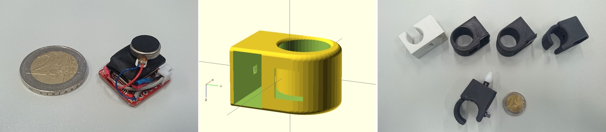
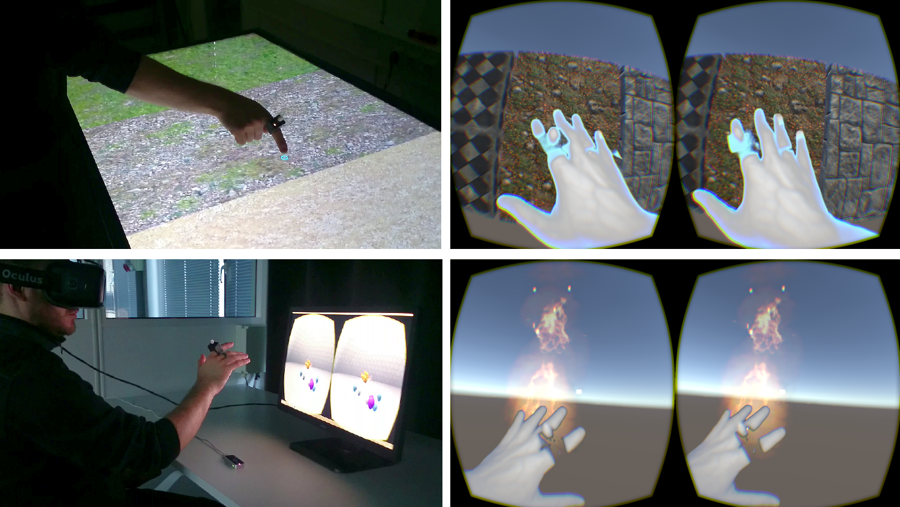

# HapRing
<b>Vibrotactile Ring for Wireless 3D Interaction</b>

HapRing is a finger-worn device, avoiding cables by using a low-energy wireless technology. 
A vibrating element is controlled by embedded software to provide haptic feedback at different intensities according to signals received from the computer.
The embedded software running on the HapRing is managed by an RF51822 SoC (System on a Chip) based on a 32-bit ARM Cortex, supporting Bluetooth Smart (2.4 GHz Band) for ultra-low-power wireless applications. 
All the components are placed on a small development board (18.5 mm × 21.0 mm) including power connectors (supporting a working voltage from 1.8 V to 3.3 V) and a set of I/O ports used to connect the micro-joystick with command button and the Linear Resonant Actuator (LRA, 5mm diameter x 3mm thickness) which is a shaft-less vibration motor attached to an active haptic driver (TI DRV2605). As a power source, we used a Lithium Polymer Ion (LyPo) rechargeable battery which outputs a nominal 3.7 V at 40 µA h. A voltage converter and a micro USB plug were included. An optional IR LED (with 880 nm wavelength for compatibility with a PPT tracking system) is connected to the ring’s top for external reference support. Besides, an IMU is integrated, providing 9-DoF data from a 3-axis combo chip (L3GD20H and LSM303D). As we used symmetrical design, the device works just as well for left-handed users as for right-handed users. The device dimensions are 47 mm height × 30 mm width × 22 mm depth. The variant of the device in the figure was 3D-printed with PLA material and has a total weight of 20 grams. 

This repository contains the necessary files to build a new device; model files for 3D printing, schematics for electronics, and embedded/testing code.

The device can be used in multi-touch tabletops to provide vibrotactile sensation according to materials displayed with different textures. Different sensations can also be provided in VR, from enriched textures to tactile effects for collisions in mini-games supporting hand-tracking, and vibration patterns to notify contact with dangerous objects (i.e., hand getting too close to the fire).

